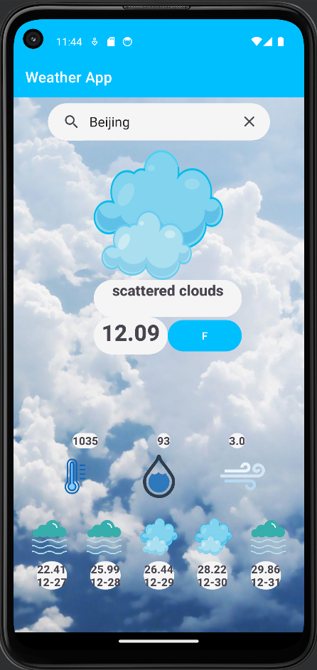
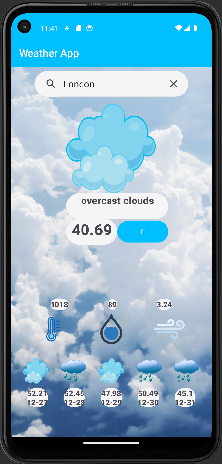
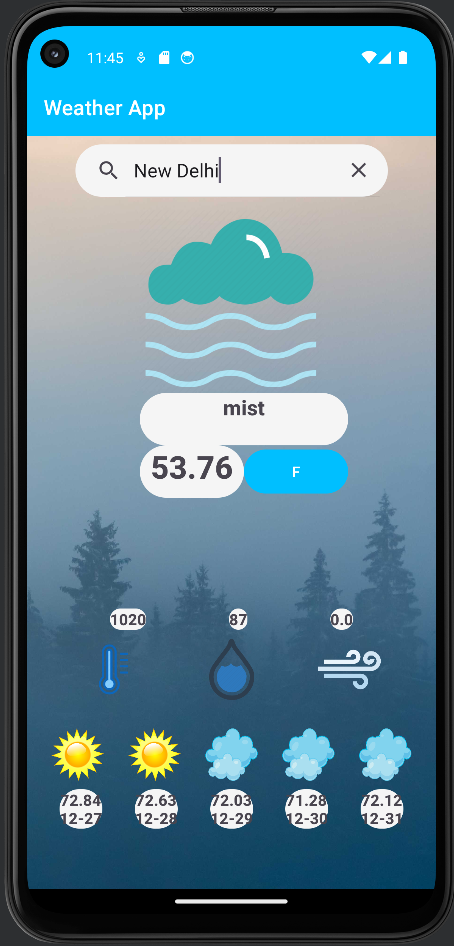
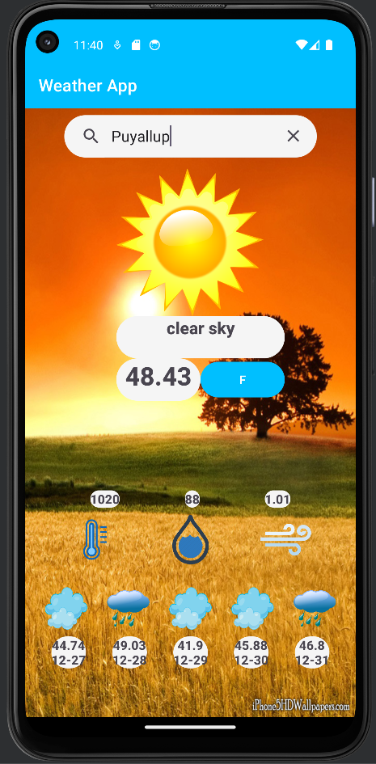

# WeatherApp

## Overview
WeatherNow is a simple and intuitive Android app that allows users to search for weather
conditions by city and view both the current weather details and a five-day forecast.
With a user-friendly interface and real-time weather data, users can stay informed about
the weather in their desired locations.

## Features
- City Search: Search for weather information by entering the name of the city.
- Current Conditions: Get real-time updates on the current weather, including temperature, humidity, wind speed, and more.
- Five-Day Forecast: Plan ahead with a detailed five-day weather forecast for the selected city.
- Different Metrics: Use the button to swap between imperial or metric system.

## Screenshots

